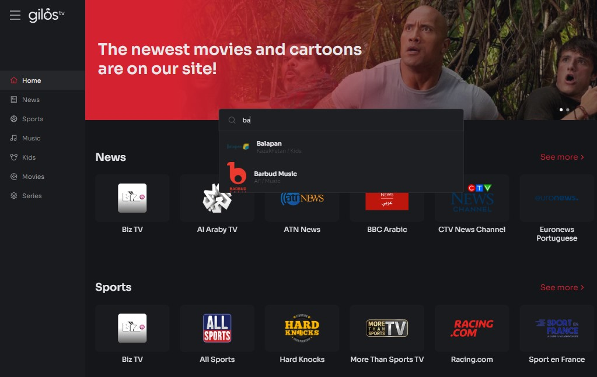

# Gilostv - free tv web-app

What it is:

Gilostv is a web application that allows to watch tv online. I am using free tv channels [api](https://github.com/iptv-org/iptv) streaming. You can search channels sort by country and category.

Installation:
To build, download the files from the repository and install the dependencies use npm: npm install. After that, type 'npm run start' in console to run application in development mode, or 'npm run build' to get built bundle (appears in dist folder).

Deployed version you can find [here](https://gilostv.netlify.app/).

Technologies: Angular, TypeScript, RxJs, Redux, SCSS, eslint, VideoJS

Technical features:

- Adaptive layout, application works equally well on desktops, tablets and mobile devices, fully responsive. 
- Video player using VideoJS
- Sort and filter channels
- The app split into modules: core, shared, tv and channel
